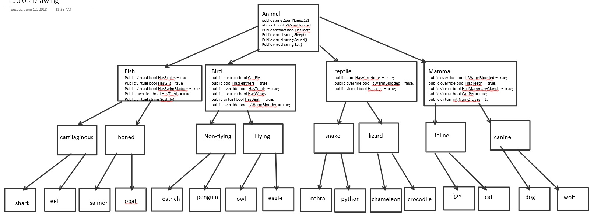

# Lab-06-Interfaces
CODE: Interfaces assignment Code Fellows 401 C#/ASP.NET course

**Author**: Earl Jay Caoile  
**Version**: 1.0.0

## Overview
This console app shows a list of animals in order to demonstrate the 4 OOP principles.

## Getting Started
The following is required to run the program.
1. Visual Studio 2017 
2. The .NET desktop development workload enabled
3. No External NuGet packages are required for this application. 

## Example

## Program Path
 - enter two names for game
 - choose spaces to place to marker
 - after game, decide to play a new game or quit

## Architecture
This application is created using ASP.NET Core 2.0 Console applicaitons.  
*Language*: C#  
*Type of Applicaiton*: Console Application  

## Change Log
06-12-2018 9:00 AM - initial scaffolding  

